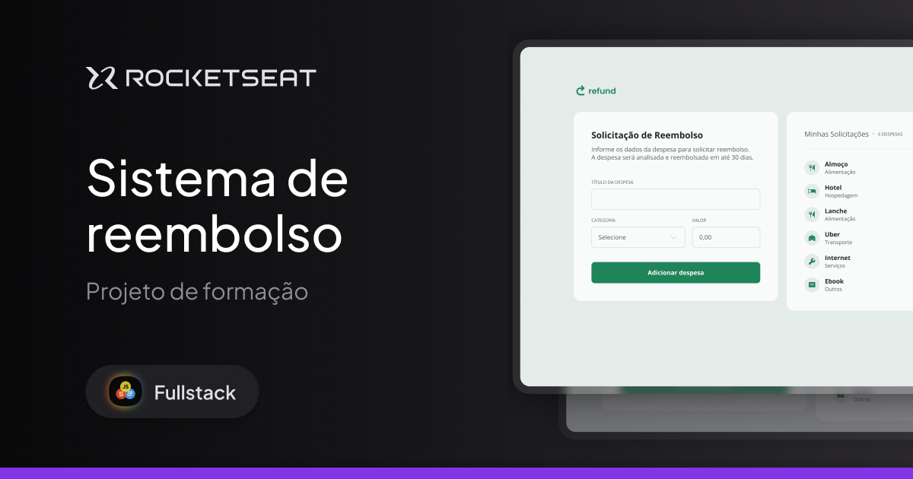

<!-- title page -->
<h1 align="center"> Sistema "Refund" de reembolso </h1>

<!-- nav -->

  <a href="#-tecnologias">Tecnologias</a>&nbsp;&nbsp;&nbsp;|&nbsp;&nbsp;&nbsp;
  <a href="#-projeto">Projeto</a>&nbsp;&nbsp;&nbsp;|&nbsp;&nbsp;&nbsp;
  <a href="#-layout">Layout</a>

<!-- cover -->

  

## 🚀 Tecnologias
Esse projeto foi desenvolvido com as seguintes tecnologias:

- HTML e CSS
- Git e Github
- JavaScript

 

## 💻 Projeto
O projeto <strong>Refund</strong> é um sistema de reembolso de despesas, desenvolvido durante a formação Full Stack da [Rocketseat](https://www.rocketseat.com.br/).  

Neste projeto foram desenvolvidas soluções em <strong>HTML</strong> e <strong>CSS</strong>, aplicando soluções semânticas e modernas. Além disso, seus scripts foram modularizados para seguir as melhores práticas de mercado e foram inteiramente produzidos com <strong>JavaScript</strong>.

> [Navegue pela aplicação aqui](https://rkt-ffs-06-refund.vercel.app/)

 

## 🔖 Layout
Desenvolvido por [Millena Martins](https://www.linkedin.com/in/millenamartins/), Product Designer na Rocketseat, você também pode acessar o [layout do projeto](https://www.figma.com/proto/YTV6Tj8IyiFCAkMA6wk0BV/Sistema-de-reembolso?page-id=3%3A376&node-id=1119-1268&viewport=20%2C246%2C0.37&t=EVFfoGfcCzaCFImO-1&scaling=min-zoom&content-scaling=fixed&starting-point-node-id=1119%3A1268).